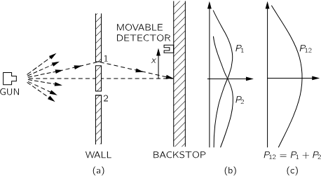
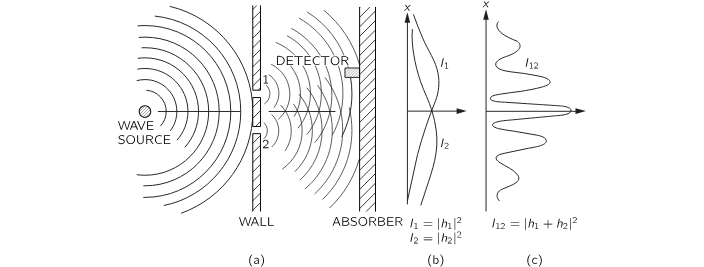
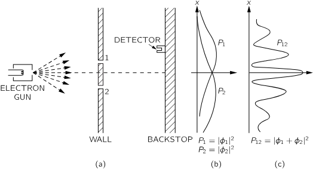
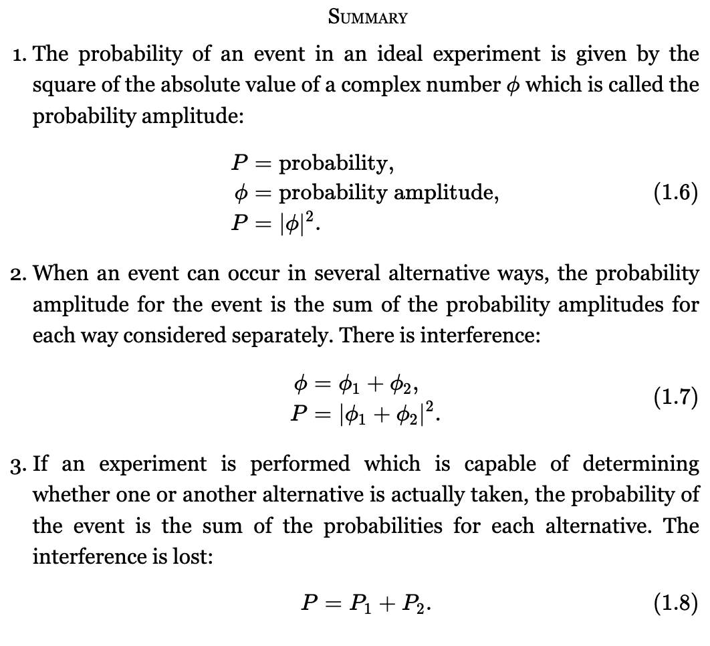

>[!Caution] Disclaimer
> As I prepare for next semester's physics course, I'll be sharing a series of posts based on *The Feynman Lectures on Physics*. If you're looking for a more in-depth study, I recommend checking out [the original lectures](https://www.feynmanlectures.caltech.edu/III_toc.html). All the pictures (unless otherwise credited) are from the lecture notes.

Quantum entities are neither particles nor clouds.. so how should we define them? Electrons! Their mysterious behavior gives us significant insight into the nature of quantum systems.

### An experiment with bullets

What happens when they all arrive in lumps? We measure probability of arrival — we can think of this as we fire bullets continuously for 10 years and record where each one lands. 
- With only hole 1 open (hole 2 blocked), we observe a distribution $P_1$​.
- With only hole 2 open (hole 1 blocked), we observe $P_2$​.

Here's the interesting part. With both holes open, we get the probability distribution equal to the sum of each hole open alone.
$$
P_{12} = P_1 + P_2
$$
This result is called an observation of *no interference*. 

### An experiment with waves

Now let's think about waves. The wave source is jiggled up and down, creating ripples on the surface. What we measure isn't just the motion of the water, but more like its energy — something quantified by the *intensity* of the wave.. or the *mean square of the displacement*.
Here, the wave amplitude $h$ is represented as a complex number, and the total intensity $I_{12}$​ is calculated using the complex inner product:

$$
I_{12} = |h_1|^2 + |h_2|^2 + 2|h_1||h_2| \cos \delta
$$

We don't need to dive deep into the theory here. The key question is: why isn't $I_{12}$ simply equal to $I_1 + I_2$?

There's a single wave coming from the source, spreading across the surface. When it reaches the barrier with two slits, each slit acts like a new source of ripples. The waves emerging from each slit spread outward and overlap, which means they _interfere_ with each other.

### An experiment with electrons

It’s really difficult to set up this kind of experiment in a real-world setting — the apparatus would have to be built on an incredibly small scale. But thanks to many experiments that have been conducted over the years, we know how electrons behave in such scenarios.

What’s really fascinating is that electrons are **particles**, yet they behave like **waves**.  
Unlike water waves, they can’t be split or spread out, so they always arrive in lumps. So why do we still see interference?
If you look at (c), we observe that when we close slit 1 (or 2) $P_{12}$ is sometimes higher than the sum, or sometimes less. In other words, opening or closing a slit increase or decreases the intensity. So we say electrons are *sometimes like a particle and sometimes like a wave*.

Let's now change the experiment slightly. Suppose we shine a light near the slits behind the wall at (a), to *watch* the electrons. We might see a flash at hole 1 or hole 2 — and then we know which slit the electron went through. And we record the distributions $P_1$ and $P_2$ accordingly. How do we get $P_{12}$? This time we can count the time we hear the click sound from the detector. What do we have now?

$$
P'_{12} = P_1 + P_2
$$

Wait — what just happened? When we look at the electrons, their distribution changes. That is, observation destroys interference.

>[!Note]
>We've seen how electrons, despite being particles, show interference patterns. But why do electrons create the patterns? They don't just take one path. Instead, they *explore all possible paths*, and each path contributes a probability amplitude. These amplitudes interfere — sometimes constructively, sometimes destructively — which leads to the observed pattern.
>
>But this idea of sum over paths isn't limited to electrons. It applies to photons (particles of light) as well. This is a core idea of quantum theory, often described as Feynman’s *sum over histories*. A great video that gives you an intuition about this (and quantum physics) can be found [here](https://www.youtube.com/watch?v=KTzGBJPuJwM).

## Summary

Quantum mechanics is different from classical mechanics in a way that we can only predict the odds — we do not know exactly what would happen.

Heisenberg stated the uncertainty principle.

$$
\Delta x \cdot \Delta p \geq \frac{\hbar}{2}
$$

It can be interpreted as *the uncertainties in the position and momentum of a particle at any instant must have their product greater than or equal to half the reduced Planck constant*. we can't determine the momentum and the position of a particle sufficiently accurately. For a more detailed explanation of the Heisenberg Uncertainty Principle, see [here](https://www.youtube.com/watch?v=MBnnXbOM5S4).
