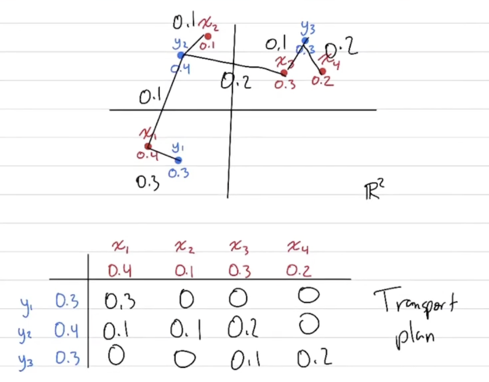
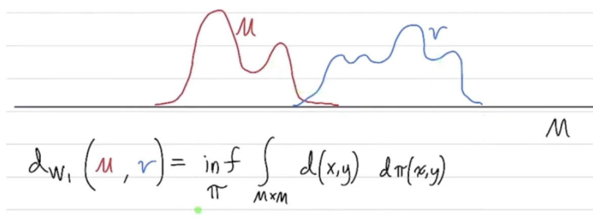
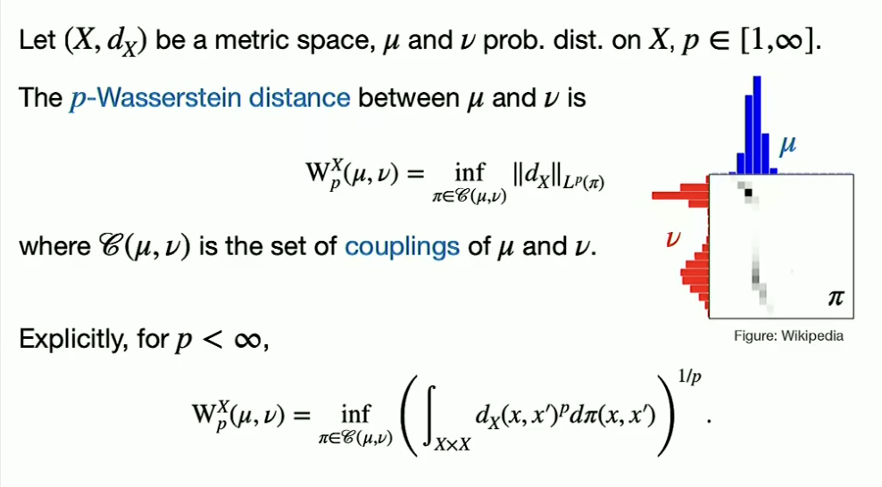
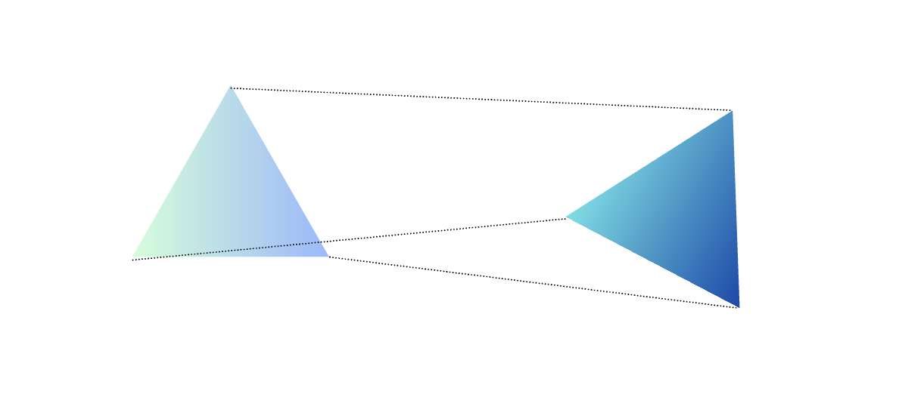
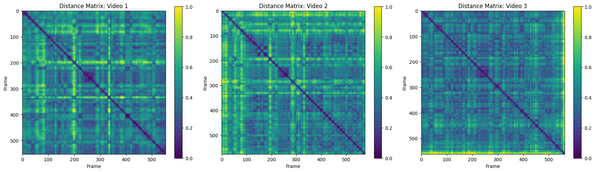
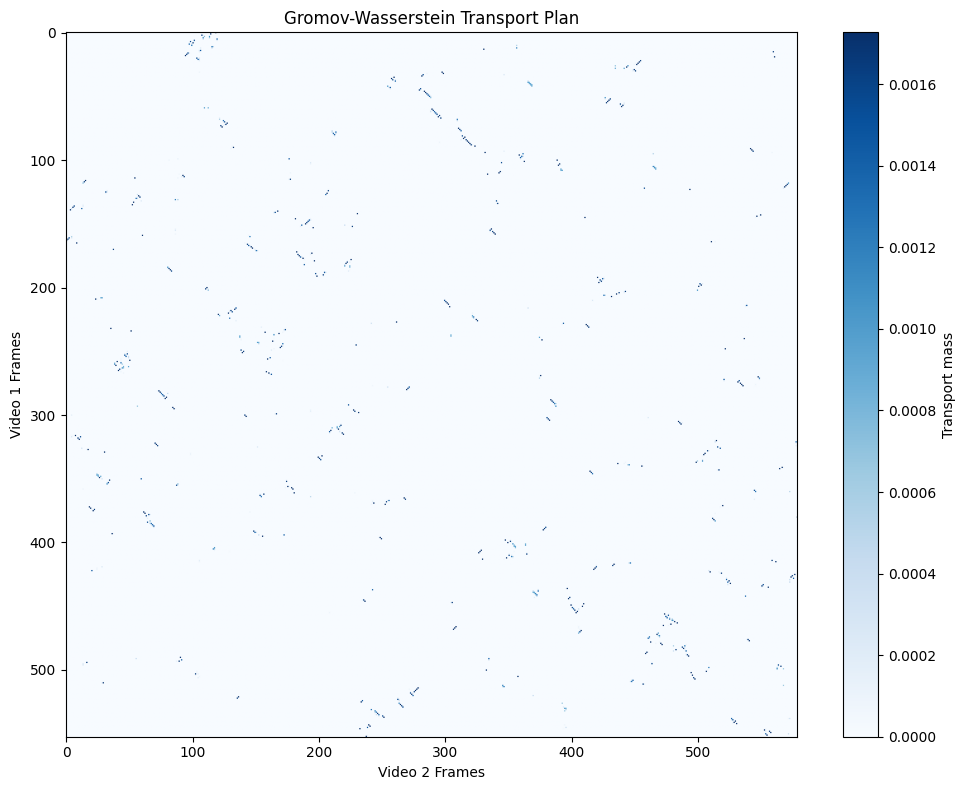

I’ve been working on a machine learning project involving the comparison of motion patterns extracted from dance videos. Our initial pipeline relied on DTW and several time-based distance metrics, but the results were not as robust as we expected. There was a suggestion to explore the Gromov–Wasserstein (GW) distance, and it turned out to be a very interesting idea! Let's start with..

## Wasserstein Distance
 
Intuitively, it quantifies the minimum "cost" of transforming one probability distribution into another, where the cost is defined in terms of the distance between points in the space. Let's look at the example below.


 from [this lecture](https://www.youtube.com/watch?v=CDiol4LG2Ao).

The cost at i,j is defined as the amount of mass moved ($\pi_{ij}$) times the distance between the points ($d(x_i, y_j)$). The total cost is the sum of all individual costs.

$$
d_{W_1}\!\left( \sum_i \alpha_i \delta_{x_i},\; \sum_j \beta_j \delta_{y_j} \right)
= \min_{\{\pi_{ij}\}} \left\{
    \sum_{i,j} \pi_{ij} \, d(x_i, y_j)
    \;:\;
    \pi_{ij} \ge 0,\;
    \sum_i \pi_{ij} = \beta_j,\;
    \sum_j \pi_{ij} = \alpha_i
\right\}.
$$

For general probability measures with continuous support, the Wasserstein distance is defined as:




 from [this lecture](https://www.youtube.com/watch?v=gjcz3mQ3asw).

## Gromov-Wasserstein Distance

What if two distributions we want to compare do not live in the same space? For example, we have two graphs with different numbers of nodes, and we want to compare their structures. This is where the Gromov-Wasserstein distance comes into play.

$$
GW_p(X,Y)
\;=\;
\inf_{\pi \in \Pi(\mu_X, \mu_Y)}
\left(
\int_{X \times Y}
\int_{X \times Y}
\big| d_X(x,x') - d_Y(y,y') \big|^p
\;
d\pi(x,y)\, d\pi(x',y')
\right)^{1/p}.
$$

Now we can't use distance between points directly, since they are in different spaces. Instead, we look at the internal structure. 



Shape is... the relational structure formed by the distances between points. Even if two objects exist in entirely different coordinate systems, they can still have identical internal structures and thus represent the same shape.

Look at the cost function, we are minimizing the difference in pairwise distances within each space, weighted by the transport plan $\pi$.

## GW Distance in Python

All good! But how to compute coupling π(i,j)? In principle, computing the exact GW coupling requires solving a non convex quadratic optimization problem, which is computationally challenging. In practice, we instead use an entropic regularized version

$$
\min_{\pi} \left(
    \sum_{i,i',j,j'} 
        \pi(i,j)\,\pi(i',j') \,
        \big| d_X(x_i, x_{i'}) - d_Y(y_j, y_{j'}) \big|
    \;+\;
    \varepsilon\, \mathrm{KL}\!\left(\pi \,\middle\|\, \mu_X \otimes \mu_Y \right)
\right)
$$

In Python, we can use the `POT` (Python Optimal Transport) library to compute the GW distance. Here's a simple example:

```python
import numpy as np
import scipy as sp
import ot


def _flatten_poses(poses):
    n_frames = len(poses)
    n_landmarks = poses[0].shape[0]
    # Mediapipe pose landmarks are 3D so each frame is flattened into xyz coordinates.
    return poses[:, :, :3].reshape(n_frames, n_landmarks * 3)


def compute_distance_matrices(poses1, poses2):
    X1 = _flatten_poses(poses1)
    X2 = _flatten_poses(poses2)
    
    D1 = sp.spatial.distance.cdist(X1, X1)
    D2 = sp.spatial.distance.cdist(X2, X2)
    
    D1 /= D1.max()
    D2 /= D2.max()
    
    return D1, D2


def compute_gromov_wasserstein(poses1, poses2, verbose=False, log=False):
    X1 = _flatten_poses(poses1)
    X2 = _flatten_poses(poses2)
    
    D1 = sp.spatial.distance.cdist(X1, X1)
    D2 = sp.spatial.distance.cdist(X2, X2)
    
    D1 /= D1.max()
    D2 /= D2.max()
    
    p = ot.unif(len(X1))
    q = ot.unif(len(X2))
    
    gw_distance, log_dict = ot.gromov.gromov_wasserstein2(
        D1, D2, p, q, 
        loss_fun='square_loss',
        verbose=verbose,
        log=True
    )
    
    transport_plan = ot.gromov.gromov_wasserstein(
        D1, D2, p, q,
        loss_fun='square_loss',
        verbose=verbose
    )
    
    if log:
        return gw_distance, transport_plan, log_dict
    
    return gw_distance, transport_plan


def compute_gw_from_distance_matrices(D1, D2, p=None, q=None, loss_fun='square_loss', verbose=False, log=False):
    if p is None:
        p = ot.unif(D1.shape[0])
    if q is None:
        q = ot.unif(D2.shape[0])
    
    gw_distance, log_dict = ot.gromov.gromov_wasserstein2(
        D1, D2, p, q,
        loss_fun=loss_fun,
        verbose=verbose,
        log=True
    )
    
    transport_plan = ot.gromov.gromov_wasserstein(
        D1, D2, p, q,
        loss_fun=loss_fun,
        verbose=verbose
    )
    
    if log:
        return gw_distance, transport_plan, log_dict
    
    return gw_distance, transport_plan

```

>[!Note]
> More general case with GW distance can be found in the [official doc](https://pythonot.github.io/auto_examples/gromov/plot_gromov.html).

I loaded two dance videos and extracted pose keypoints (`poses1`, `poses2`) using MediaPipe. Each pose is represented as a set of 3D coordinates for various landmarks on the body.


```python
# necessary imports...

D1, D2 = compute_distance_matrices(poses1, poses2)

pl.figure(figsize=(12, 5))
pl.subplot(121)
pl.imshow(D1, cmap='viridis')
pl.colorbar()
pl.title("Distance Matrix: Video 1")
pl.xlabel("Frame")
pl.ylabel("Frame")

pl.subplot(122)
pl.imshow(D2, cmap='viridis')
pl.colorbar()
pl.title("Distance Matrix: Video 2")
pl.xlabel("Frame")
pl.ylabel("Frame")

pl.tight_layout()
pl.show()
```



```python
gw_distance, transport_plan, log = compute_gromov_wasserstein(
    poses1, poses2, 
    verbose=True, 
    log=True
)

print(f"\nGromov-Wasserstein Distance: {gw_distance:.6f}")
```

```
It.  |Loss        |Relative loss|Absolute loss
------------------------------------------------
    0|3.458162e-02|0.000000e+00|0.000000e+00
    1|1.794146e-02|9.274697e-01|1.664016e-02
    2|1.203143e-02|4.912159e-01|5.910030e-03
    3|1.000797e-02|2.021852e-01|2.023463e-03
    4|9.375145e-03|6.749990e-02|6.328213e-04
    5|9.034664e-03|3.768613e-02|3.404815e-04
...
   56|7.786634e-03|3.835101e-07|2.986253e-09
   57|7.786634e-03|1.984439e-08|1.545210e-10

Gromov-Wasserstein Distance: 0.007787
```

```python
pl.figure(figsize=(10, 8))
pl.imshow(transport_plan, cmap='Blues', aspect='auto')
pl.colorbar(label='Transport mass')
pl.title('Gromov-Wasserstein Transport Plan')
pl.xlabel('Video 2 Frames')
pl.ylabel('Video 1 Frames')
pl.tight_layout()
pl.show()

print(f"Transport plan shape: {transport_plan.shape}")
print(f"Transport plan sum: {transport_plan.sum():.6f} (should be ~1.0)")
```



```
Transport plan shape: (553, 579)
Transport plan sum: 1.000000 (should be ~1.0)
```

When two dance sequences are similar, the GW distance becomes smaller and the transport plan tends to show a clear diagonal structure that aligns frames across videos.

>[!Important] Summary
>- GW distance provides a flexible way to compare sequences with different lengths or coordinate systems.
>- For motion analysis in particular, it captures structural similarity beyond simple time alignment and serves as a strong complement to DTW based methods.