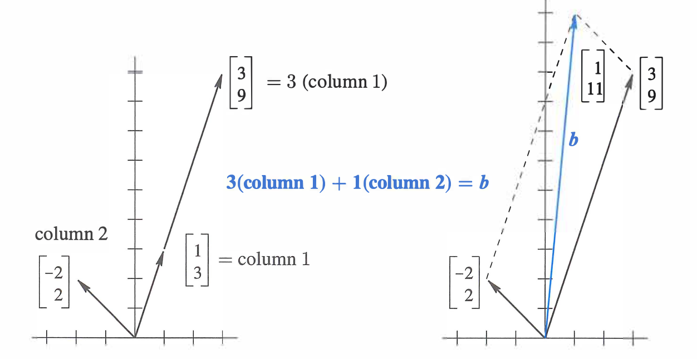

Linear Algebra is sooo important! So I've decided to revisit it during my winter break! I'll be posting my notes here :)

# 1. The Geometry of Linear Equations

## 1.1 Solving a System of Linear Equations

$$
\begin{align*}
x - 2y &= 1 \\
3x + 2y &= 11
\end{align*}
$$

- Matrix view

$$
\begin{bmatrix}
1 & -2 \\
3 & 2
\end{bmatrix}
\begin{bmatrix}
x \\
y
\end{bmatrix}
=
\begin{bmatrix}
1 \\
11
\end{bmatrix}
$$

$$
Ax = b
$$

- Row picture

This is classic! A row is a linear equation, so we're gonna look at it row by row, aka equation by equation. Graphically, it's the same as looking at the intersection of two lines in 2D space. The solution to the system is the point where these two lines intersect ($x=1, y=2$).

This is easy in two dimensions, but in higher dimensions we might be lost!

- **Column picture***

$$
x
\begin{bmatrix}
1 \\
3
\end{bmatrix}
+
y
\begin{bmatrix}
-2 \\
2
\end{bmatrix}
=
\begin{bmatrix}
1 \\
11
\end{bmatrix}
$$

This was not so intuitive to me at first.. but let's see it this way..

Each column is related to a variable, so we can think of the system as a vector of coefficients, aka **linear combination of columns**. We need a right combination of $x$ and $y$ -- $x$ amount of $(1, 3)$, and $y$ amount of $(-2, 2)$ -- to get the final vector $(1, 11)$.

>[!Caution] Super Important!
> $b$ is a linear combination of the columns of $A$.

Graphically, we would start by drawing two vectors of unit length, and then see how much we need to scale them to get to the target vector.

>[!Note]
> Here we notice with all the combinations of $x$ and $y$, we can fill the whole plane. Is it always the case? Do the linear combinations of n columns always fill the n-dimensional space? It's interesting to think about when this is not the case.

# 2. Elimination with Matrices

## 2.1 Elimination & Back-Substitution

It's simple if we can just reduce a n-dimensional matrix to upper triangular form with n pivots, following Gaussian elimination. We also know its determinant (product of all the pivots) and inverse. (But the world is not always nice and easy. Sometimes we have fewer pivots than dimensions.)

With the upper triangular matrix $U$, we can solve for the variables starting from the last one and moving upwards. This is called back-substitution.

We can make an augmented matrix. This way we can solve for multiple right-hand sides at once, which is useful when we have to solve the same system with different b's.

## 2.2. Matrices

>[!Note]
> $$\text{matrix} \times \text{column} = \text{column}$$
> If we multiply a matrix by a vector, we get a linear combination of the columns of the matrix.

If we multiply a row vector by a matrix, we get a linear combination of the **rows** of the matrix. What's the matrix that does subtraction?

Subtract 3 * row 1 from row 2:

$$
\begin{pmatrix}
?
\end{pmatrix}
\begin{pmatrix}
1 & 2 & 1 \\
3 & 8 & 1 \\
0 & 4 & 1
\end{pmatrix}
=
\begin{pmatrix}
1 & 2 & 1 \\
0 & 2 & -2 \\
0 & 4 & 1
\end{pmatrix}
$$

Look at the result matrix row by row. How to get $[1, 2, 1]$? We need 1 * (row 1) and 0 of others, so the first row of the $?$ matrix is $[1, 0, 0]$. If we didn't do anything, the $?$ matrix would have been the identity matrix.

To get $[0, 2, -2]$, we need -3 * (row 1) and 1 * (row 2). So the second row of the $?$ matrix is $[-3, 1, 0]$.

$$
\begin{pmatrix}
1 & 0 & 0 \\
-3 & 1 & 0 \\
0 & 0 & 1
\end{pmatrix}
\begin{pmatrix}
1 & 2 & 1 \\
3 & 8 & 1 \\
0 & 4 & 1
\end{pmatrix}
=
\begin{pmatrix}
1 & 2 & 1 \\
0 & 2 & -2 \\
0 & 4 & 1
\end{pmatrix}
$$

Let's call our $?$ matrix $E_{21}$, which means we are doing elimination to get a zero in the $(2, 1)$ position. In a similar way, we can get $E_{32} as below.

$$
\begin{pmatrix}
1 & 0 & 0 \\
0 & 1 & 0 \\
0 & -2 & 1
\end{pmatrix}
$$

Let's put everything we did in a single matrix $E$:

$$
E_{32} (E_{21} A) = U
$$
$$
E A = U
$$

>[!Warning]
> We can remove the parentheses but not change the orders.

A **permutation matrix**, let's say here a matrix that exchanges rows 1 and 2:

$$
\begin{pmatrix}
0 & 1 \\
1 & 0
\end{pmatrix}
\begin{pmatrix}
a & b \\
c & d
\end{pmatrix}
=
\begin{pmatrix}
c & d \\
a & b
\end{pmatrix}
$$

$$
P
=
\begin{pmatrix}
0 & 1 \\
1 & 0
\end{pmatrix}
$$

It's fun to think about what matrix would exchange columns instead of rows. Where do I put it? On the right!

$$
\begin{pmatrix}
a & b \\
c & d
\end{pmatrix}
\begin{pmatrix}
0 & 1 \\
1 & 0
\end{pmatrix}
=
\begin{pmatrix}
b & a \\
d & c
\end{pmatrix}
$$

## 2.3. Peeking in Inverses

$$
\begin{pmatrix}
1 & 0 & 0 \\
-3 & 1 & 0 \\
0 & 0 & 1
\end{pmatrix}
$$

I wanna find a matrix undoes this step and gives us the identity.

Instead of subtracting 3 * row 1 from row 2, we can **add** 3 * row 1 to row 2:

$$
\begin{pmatrix}
1 & 0 & 0 \\
3 & 1 & 0 \\
0 & 0 & 1
\end{pmatrix}
\begin{pmatrix}
1 & 0 & 0 \\
-3 & 1 & 0 \\
0 & 0 & 1
\end{pmatrix}
=
\begin{pmatrix}
1 & 0 & 0 \\
0 & 1 & 0 \\
0 & 0 & 1
\end{pmatrix}
$$

$$
E^{-1} E = I
$$